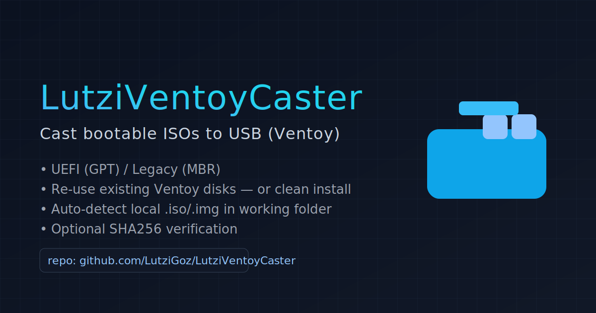

# LutziVentoyCasts

Cast Windows/Linux ISOs onto a USB drive using Ventoy — safely, fast, repeatable.
- Interactive device selection (guards against nuking your system disk)
- GPT/UEFI or MBR/Legacy modes
- Reuse existing Ventoy disks (no reformat) or clean install
- Optional SHA256 verification for ISOs
- Pure Bash, no magic
  

Windows USB Creator (Ventoy-based)

This tool automates creating a bootable USB drive for Windows installation using Ventoy, with options to download official Windows 11 ISOs or use your own.
Features

  Automatic ISO Download:

  - May 2025 Windows 11 Business Editions (recommended)

  - Archive.org Windows 11 Nov 2022 Edition (legacy option)

  - Manual selection via files.rg-adguard.net

  #Works with existing ISOs:
  If you already have a .iso or .img file, place it in the same folder as the script before running.
  The script will automatically detect and offer to use it instead of downloading.

  #UEFI or Legacy BIOS support using Ventoy (GPT or MBR).

- Re-use existing Ventoy USBs without formatting.
- Cast Windows/Linux ISOs onto a USB drive using Ventoy — safely, fast, repeatable.
- Interactive device selection (guards against nuking your system disk)
- GPT/UEFI or MBR/Legacy modes
- Reuse existing Ventoy disks (no reformat) or clean install
- Optional SHA256 verification for ISOs
- Pure Bash, no magic

  #Requirements

  - Linux system with bash

  - wget, tar, lsblk

  - sudo privileges

  - Internet connection for ISO/Ventoy downloads (unless using local ISO)

## Quick start
- git clone https://github.com/LutziGoz/LutziVentoyCaster
- cd LutziVentoyCaster
- chmod +x lz-ventoy-usb.sh
- ./lz-ventoy-usb.sh

#Notes

  - All downloaded or detected ISO files are handled in the current working directory where you run the script.

  - If multiple ISO/IMG files are found in that directory, you can choose which one to use.

  - This script will format the selected USB drive unless you choose the copy without formatting option.

#License

#MIT License.
#Copyright By LutziGoz
https://lutzigoz.com
lutzigoz@lutzigoz.com
